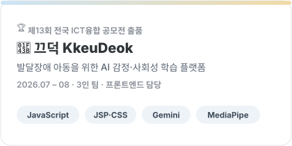
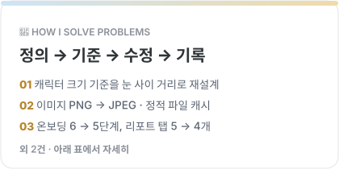
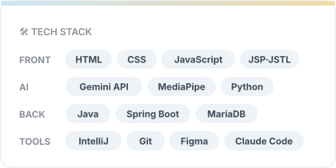
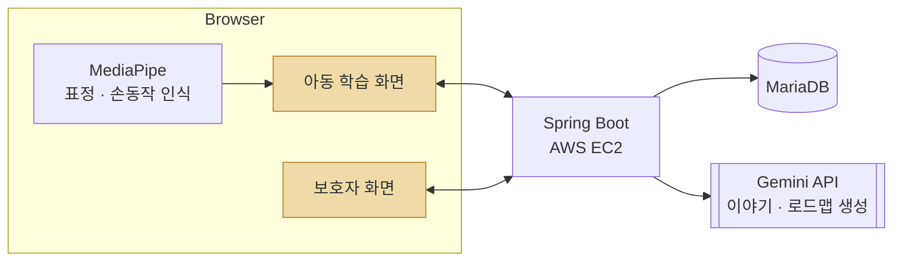

<div align="center">
<picture>
  <source media="(prefers-color-scheme: dark)" srcset="./assets/header-dark.svg">
  
</picture>


<a href="mailto:psh04man@gmail.com"></a>
<a href="https://github.com/KkeuDeok/kkeudeok"></a>
<a href="https://app.notion.com/p/1-2-8c37d0c82d3c83d0a78281c113a2b809"></a>

</div>

<br>

## About Me

```java
public class ParkSeongHyeon {
    String school = "한국폴리텍대학 서울강서캠퍼스 빅데이터소프트웨어공학과 1학년";
    String goal   = "AI 서비스 개발자";
    String[] now  = { "Vue.js", "Flutter", "Python", "AI 연계실습" };
    String motto  = "문제를 정의하고, 기준을 세우고, 고친 이유를 남긴다";
}
```

<div align="center">
<a href="#contest--끄덕-kkeudeok"><picture><source media="(prefers-color-scheme: dark)" srcset="./assets/card-project-dark.svg"></picture></a>
<picture><source media="(prefers-color-scheme: dark)" srcset="./assets/card-commits-dark.svg"></picture>
<a href="#how-i-solve-problems"><picture><source media="(prefers-color-scheme: dark)" srcset="./assets/card-problem-dark.svg"></picture></a>
<a href="#tech-stack"><picture><source media="(prefers-color-scheme: dark)" srcset="./assets/card-stack-dark.svg"></picture></a>
</div>

<br>

## Contest · 끄덕 KkeuDeok


발달장애 아동을 위한 AI 감정·사회성 학습 플랫폼입니다. 아이는 AI가 만든 이야기를 따라가며 친구의 감정을 읽고, 그 감정을 자기 표정과 손동작으로 따라 해 봅니다. 표정을 판정하는 기준은 표준 얼굴이 아니라 아이가 직접 등록한 표정입니다.

| | |
|---|---|
| 공모전 | [제13회 전국 ICT융합 공모전](https://www.ictfestival.or.kr/) (2026, 충북ICT산업협회) 디지털 시제품 출품 |
| 기간 · 팀 | 2026.07 – 2026.08 · 3인 |
| 내 역할 | 프론트엔드 (아동 학습 화면, 보호자 화면) |
| 스택 | Spring Boot 4 · Java 21 · JSP · MariaDB · Gemini API · MediaPipe · AWS EC2 |



주황색이 제가 만든 부분입니다.

- 아동 학습 화면: 캐릭터 6명 × 12포즈(72장) 교체, 정답·오답 피드백, 이야기 자동 낭독, 진입 애니메이션
- 보호자 화면: 마이페이지, PIN 재설정, 대시보드와 리포트 레이아웃

개발할 때 Claude Code를 같이 썼습니다. AI가 짠 코드도 화면에서 직접 확인했고, 맞지 않으면 되돌린 뒤 이유를 커밋에 적었습니다.

<br>

## How I Solve Problems

| 문제 | 한 일 | 결과 |
|---|---|---|
| 캐릭터 72장의 크기가 화면마다 다르고 얼굴이 잘림 | 얼굴 폭은 포즈마다 달라서 크기 기준을 눈 사이 거리로 바꿈. 첫 시도는 revert 후 다시 시도 | 모든 화면에서 눈높이와 크기가 맞음 |
| 기능 PR에 범위 밖 음성 파일 141개가 섞임 | 파일은 빼고 브라우저 낭독 기능은 남김. 되살리는 방법은 커밋에 기록 | 리뷰할 양은 줄고 기능은 그대로 |
| 학습 화면 로딩이 느림 | 배경을 PNG에서 JPEG로 바꾸고 정적 파일 캐시를 허용 | 이미지 용량과 재방문 로딩 시간 감소 |
| "단계가 많고 복잡하다"는 피드백 | 기능을 더하지 않고 줄임. 온보딩 6 → 5단계, 리포트 탭 5 → 4개 | 사용 흐름이 짧아짐 |
| PIN 재설정 중 어디서 틀렸는지 알 수 없음 | 과정을 2단계로 나누고 오류 문구를 해당 입력칸 옆에 표시 | 사용자가 바로 고칠 수 있음 |

<br>

## Tech Stack

| | 기술 | 쓴 곳 |
|---|---|---|
| Frontend |  | 끄덕 화면 개발 |
| AI |   | 끄덕 이야기 생성, 표정·손동작 인식 |
| Language |  | [프로그래머스 풀이](https://github.com/PSH04man/Programmer)를 세 언어로 |
| 배우는 중 |  | 2학기 수업, [SpringAiBasic](https://github.com/PSH04man/SpringAiBasic) |
| Tools |  | |

<br>

## Learning Log

수업 내용은 노션에 과목별로 정리하고 있습니다. 주차마다 페이지를 하나씩 만들고 이해도와 복습 횟수를 적어 둡니다. 2학기 노트는 지금도 계속 채우는 중입니다. ([1학기](https://app.notion.com/p/1-1-31c7d0c82d3c80f9ba14ecd7b17cf5fe) · [2학기](https://app.notion.com/p/1-2-8c37d0c82d3c83d0a78281c113a2b809))

| | 1학기 | 2학기 |
|---|---|---|
| AI | 생성형 AI 활용 | AI 연계실습 |
| Data | 데이터베이스 실무, 빅데이터 시각화 실습 | 빅데이터 프로그래밍(Python), 빅데이터플랫폼 실습, 빅데이터 모델링 실습 |
| Frontend · App | | Vue.js 프로그래밍, Flutter 프로그래밍 |
| Backend | 스프링부트 프레임워크 실습 | 스프링부트 프로그래밍 |
| Infra | 리눅스 OS 실습, 운영체제 | K-PaaS 구축실습(NoSQL), 정보통신 |
| CS | 자료구조, 프로그래밍 언어 실습, 정보화 활용 | 소프트웨어공학 |

<br>

## Roadmap

AI 모델을 사람들이 실제로 쓰는 서비스로 만드는 개발자가 목표입니다.

- [x] 실서비스 화면 만들기 (끄덕)
- [x] 공모전에 AI 서비스 시제품 출품
- [ ] Vue.js로 끄덕 화면 일부를 컴포넌트로 다시 만들기
- [ ] FastAPI로 AI API 서버 만들기
- [ ] LLM API와 벡터 DB로 RAG 챗봇 만들기
- [ ] ADsP, SQLD 취득 (2027)

<br>

<div align="center">
<picture>
  <source media="(prefers-color-scheme: dark)" srcset="./assets/footer-dark.svg">
  
</picture>
</div>
